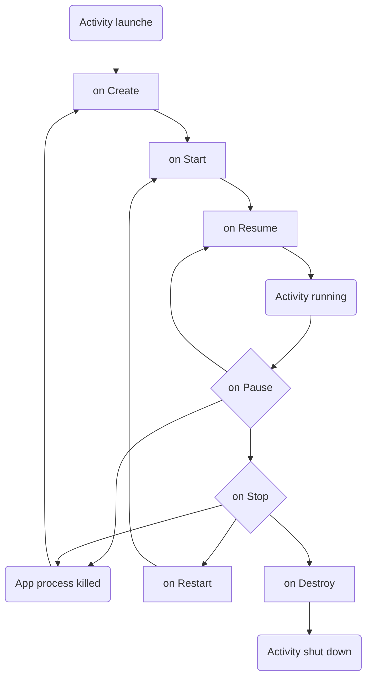

# lif

```mermaid
flowchart TB
launche(Activity launche) --> Create[on Create]
Create --> Start[on Start]
Start --> Resume[on Resume]
Resume --> running(Activity running)
running --> Pause{on Pause}
Pause --> Resume
Pause --> killed(App process killed)
killed --> Create
Pause --> Stop{on Stop}
Stop --> killed
Stop --> Restart[on Restart]
Restart --> Start
Stop --> Destroy[on Destroy]
Destroy --> down(Activity shut down)
```
