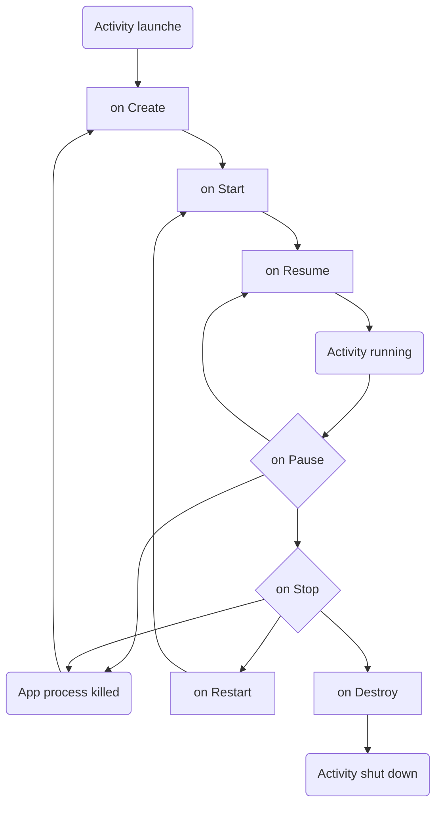
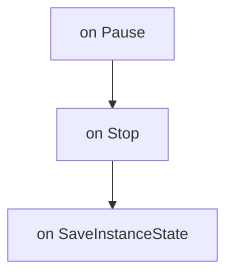
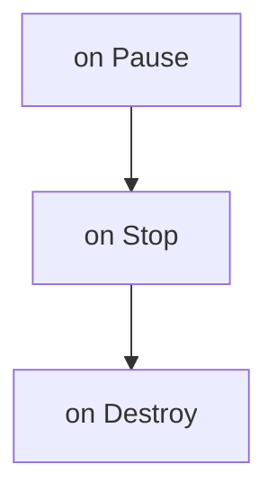
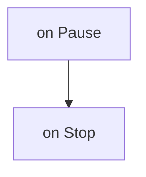

# lif

### Kliknięciu programowego przycisku EXIT (w oknie aplikacji):

### Kliknięciu sprzętowego przycisku BACK (na telefonie):

### Kliknięciu sprzętowego przycisku HOME (na telefonie)

### Kliknięciu przycisku połączenia telefonicznego (CALL - zielona słuchawka)

### Przytrzymaniu przycisku odłożenia słuchawki (HANG-UP -  czerwona słuchawka)

### Otrzymaniu tekstowej wiadomości SMS (z innego emulatora lub telefonu)

### Po otrzymaniu połączenia głosowego (z innego emulatora lub telefonu).
